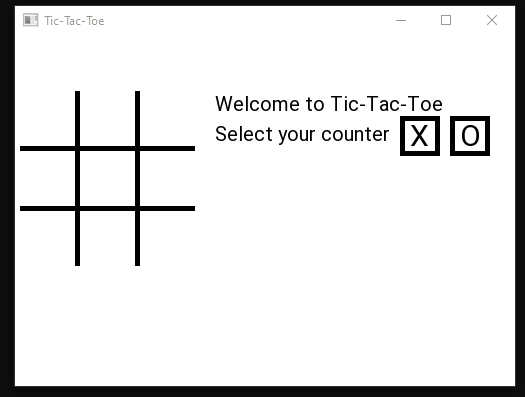

## SFML Tic-Tac-Toe

A very simple tic-tac-toe game implemented using C++ with the [SFML library](https://www.sfml-dev.org/index.php).  
Game is single player only (at this stage) and uses a minmax algorithm with alpha-beta pruning for the AI.

### Compiling the Game
To compile and run the game the SFML SDK must be downloaded. It is recommended using Visual Studio and following [SFML's tutorial](https://www.sfml-dev.org/tutorials/2.5/start-vc.php) for project configuration.
sfml-graphics, sfml-window, and sfml-system libraries are required for successful compilation.

### Running the Game
The game is operated entirely through mouse clicks.   
First select your token (X or O) using the right-hand buttons.  
Second play the game by clicking on the space you want to place your token. The AI will play immediately after you click.    
Once (if!) you win, you can play again or exit the game by clicking on the respective button at the bottom.

### Future Improvements
 - Enable multiplayer support on local network with multithreading.
 - Improve GUI
 - Improve the AI (still a few edge cases as indicated in the above gif)
 - Enable makefile support for project for simple install and use
